# Pantallas de la aplicación

## Pantalla 1 - Inicio de sesión

    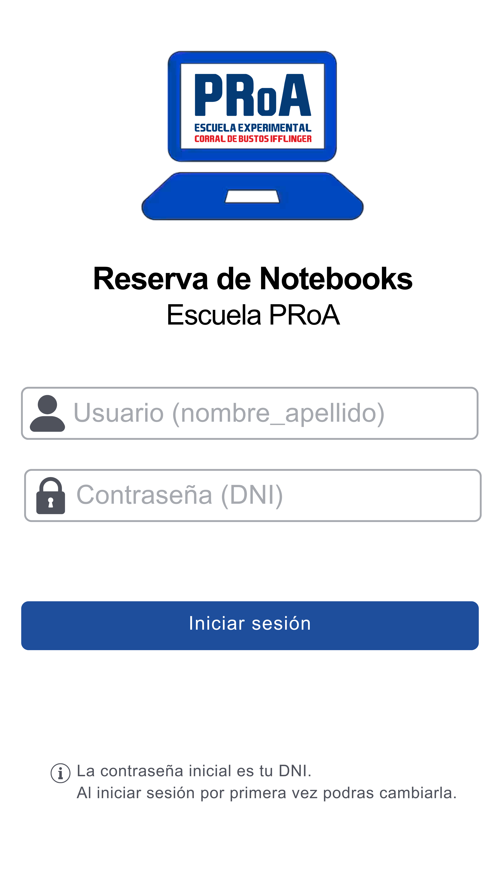

Es la primer pantalla que ve el profesor al abrir la aplicación.

### Componentes

* Logo de la escuela.
* Nombre de la aplicación.
* Campo **Usuario**.
* Campo **Contraseña**.
* Botón **Iniciar sesión**.
* Mensaje indicando que la contraseña inicial es el DNI.

### Funcionamiento

El profesor ingresa su usuario y contraseña para acceder al sistema.

## Pantalla 2 - Menú principal

    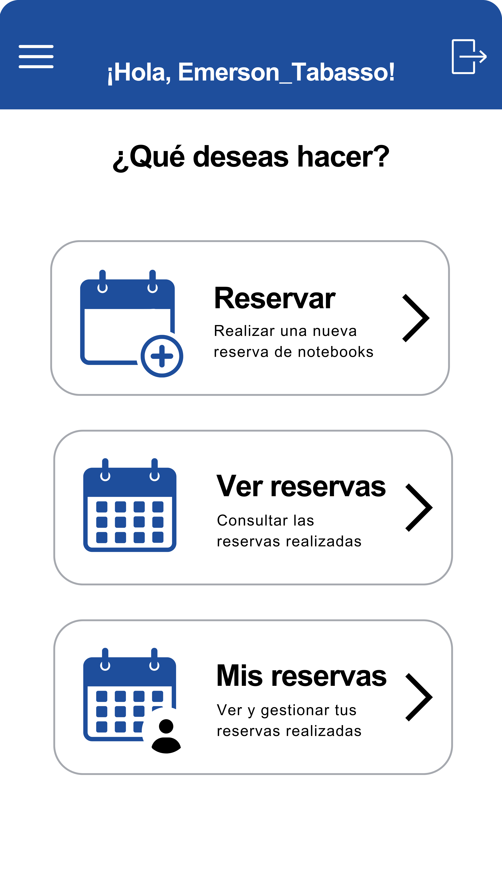

Luego de iniciar sesión correctamente, el profesor accede al menú principal.

### Opciones disponibles

* **Reservar notebooks**
* **Ver reservas**
* **Mis reservas**

Desde el menú lateral también podrá acceder a:

* Inicio.
* Mi perfil.
* Cerrar sesión.

---

## Pantalla 3 - Nueva reserva

    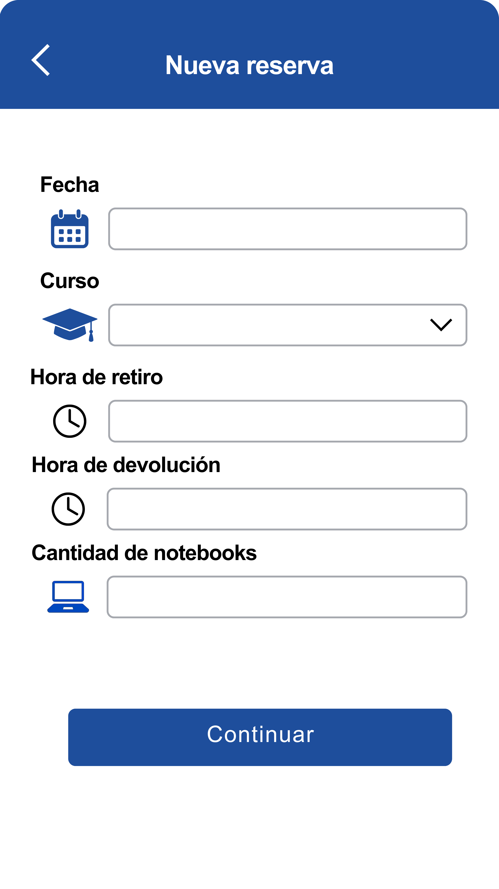

Permite registrar una nueva reserva de notebooks.

### Datos solicitados

* Fecha.
* Curso.
* Hora de inicio.
* Hora de finalización.
* Cantidad de notebooks.

### Funcionamiento

Al presionar **Continuar**, el sistema verifica que exista disponibilidad para el horario seleccionado.

Si hay notebooks disponibles, la reserva se registra correctamente.

Si no hay disponibilidad suficiente, se informa al profesor para que seleccione una menor cantidad de notebooks.

---

## Pantalla 4 - Confirmación de reserva

    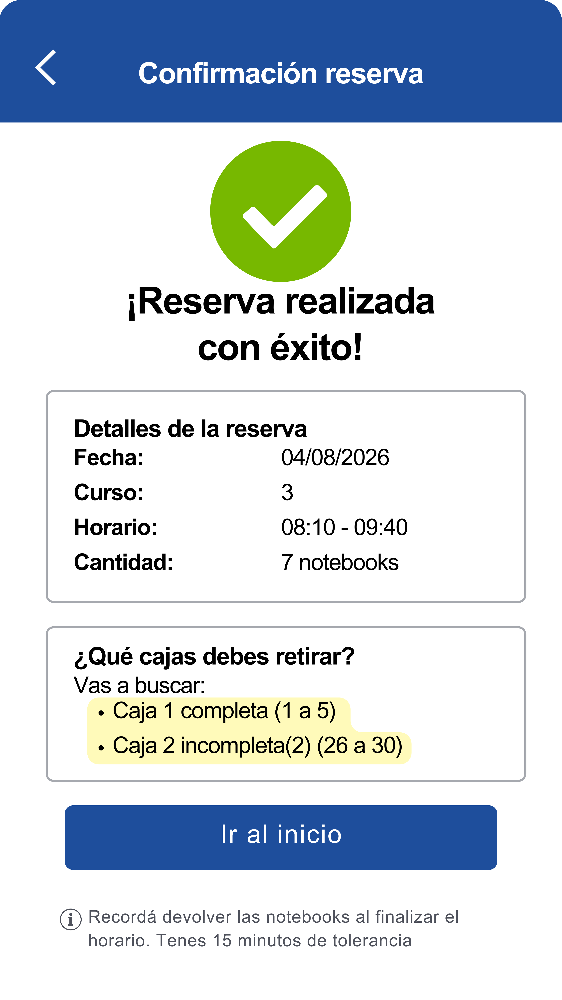

Se muestra luego de crear correctamente una reserva.

### Información mostrada

* Fecha.
* Curso.
* Horario.
* Cantidad de notebooks reservadas.

Además, el sistema informa qué cajas debe retirar el profesor.

Ejemplo:

* Caja 1 completa (Notebooks 1 a 5).
* Caja 2: Notebooks 6 y 7.

También se recuerda que las notebooks deberán devolverse al finalizar el horario y que existe una tolerancia de 15 minutos.

---

## Pantalla 5 - Ver reservas

    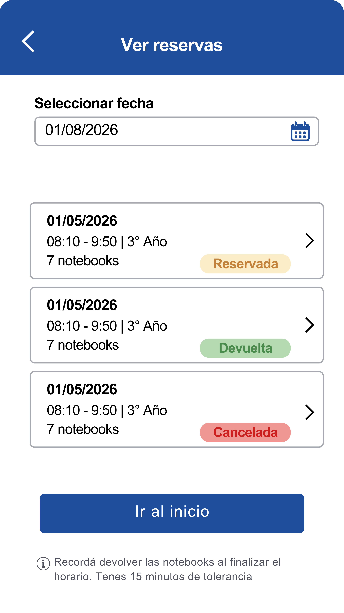

Permite consultar las reservas realizadas por todos los profesores.

### Funcionalidades

El profesor selecciona una fecha.

El sistema muestra todas las reservas correspondientes a ese día.

Para cada reserva se visualiza:

* Profesor.
* Curso.
* Horario.
* Cantidad de notebooks.
* Estado de la reserva.

Esta pantalla es únicamente de consulta y no deja hacer modificaciones.

---

## Pantalla 6 - Mis reservas

    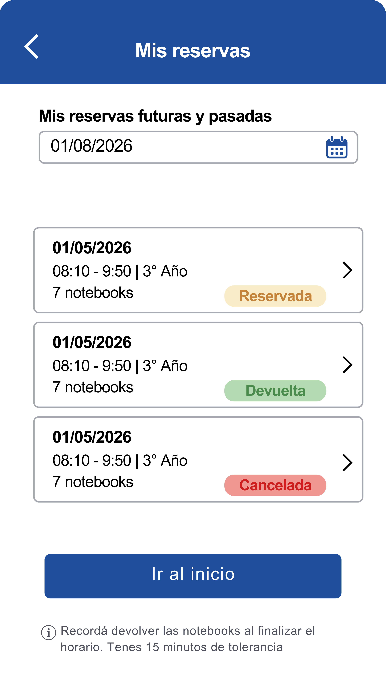

Permite consultar únicamente las reservas realizadas por el profesor que inició sesión.

### Información mostrada

Cada reserva presenta:

* Fecha.
* Curso.
* Horario.
* Cantidad de notebooks.
* Estado.

Al seleccionar una reserva se accede a su detalle.

---

## Pantalla 7 - Detalle de mi reserva

Muestra toda la información correspondiente a una reserva.

### Información

* Fecha.
* Curso.
* Horario.
* Cantidad de notebooks.
* Estado.
* Observaciones.
* Cajas asignadas.

Según el estado de la reserva, el sistema presenta diferentes acciones.

### Caso 1 - La reserva todavía no empezó

    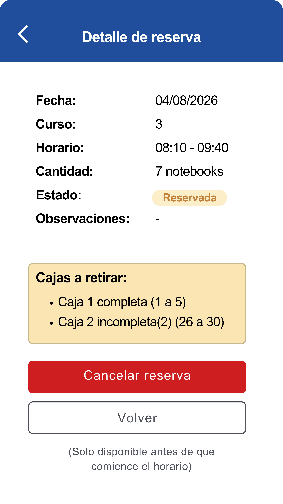

Se habilita el botón:

* **Cancelar reserva**

El profesor podrá cancelar la reserva mientras no haya iniciado el horario seleccionado.

---

### Caso 2 - La reserva está en curso

    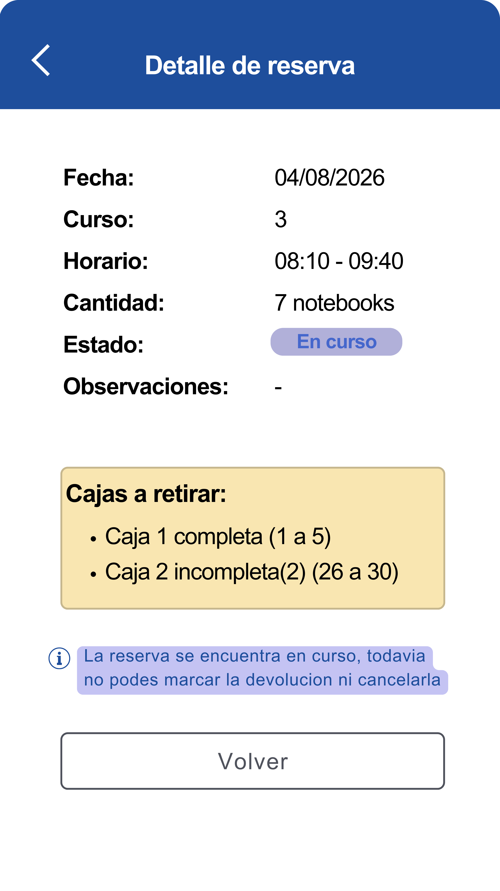

La información se muestra únicamente en modo consulta.

Durante este período no es posible cancelar la reserva ni registrar la devolución.

---

### Caso 3 - El horario ya terminó

    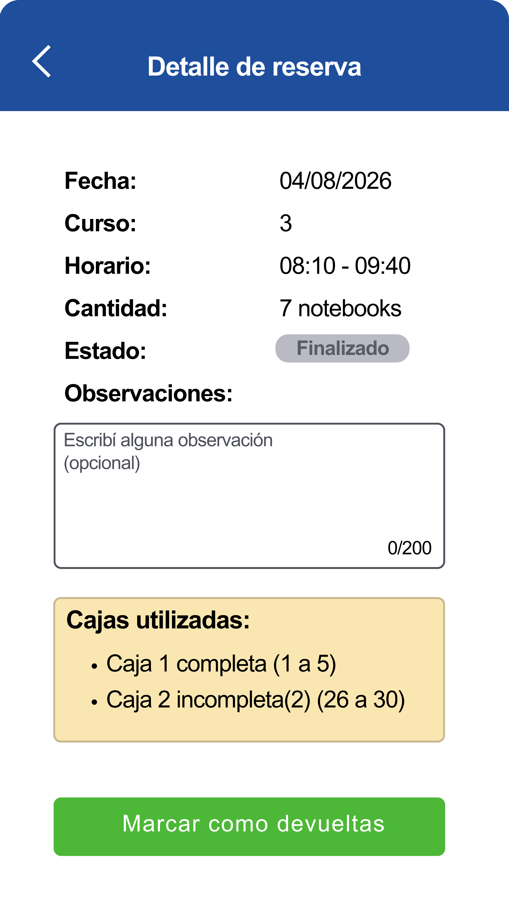

Se habilitan:

* Campo **Observaciones** (opcional).
* Botón **Marcar como devueltas**.

El profesor registra la devolución de las notebooks.

Si no realiza esta acción dentro de los 15 minutos posteriores a la finalización del horario, el sistema marcará automáticamente la reserva como devuelta.

---

### Caso 4 - Reserva finalizada

    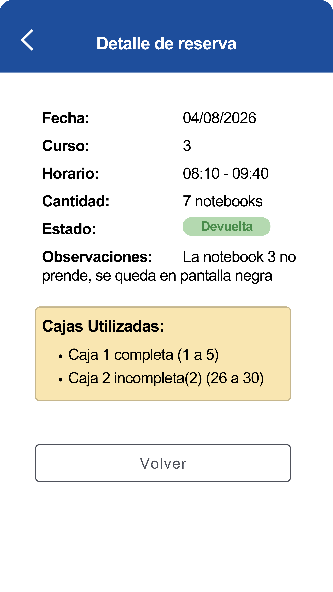

Cuando las notebooks ya fueron devueltas, la pantalla muestra:

* Información de la reserva.
* Observaciones registradas.
* Fecha y hora de devolución.

En este estado ya no se permiten modificaciones.

---

## Pantalla 8 - Confirmación de devolución

    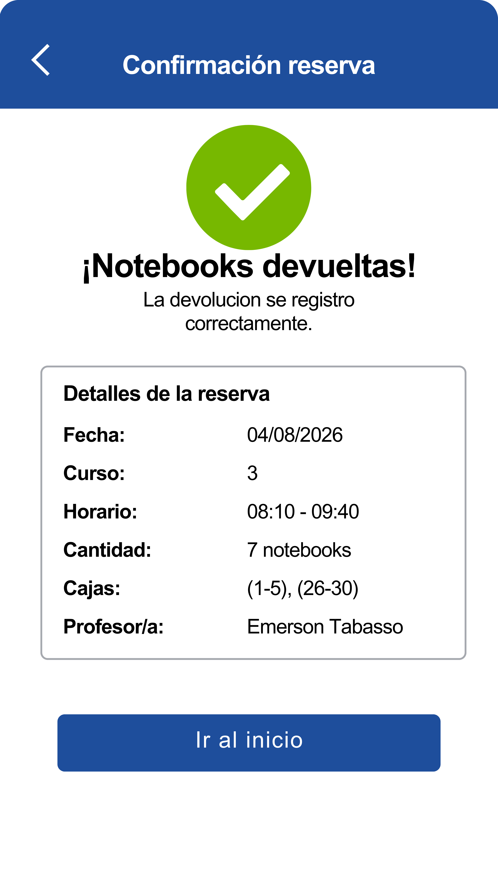

Se muestra luego de registrar correctamente la devolución.

### Información

* Fecha.
* Curso.
* Horario.
* Cantidad de notebooks.

Incluye un botón para regresar al menú principal.

---

## Pantalla 9 - Menú lateral

    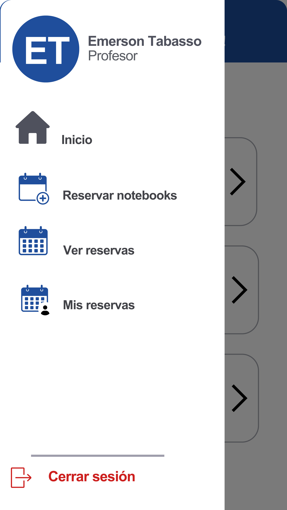

Disponible desde cualquier pantalla de la aplicación.

### Opciones

* Inicio.
* Reservar notebooks.
* Ver reservas.
* Mis reservas.
* Mi perfil.
* Cerrar sesión.

Permite desplazarse entre las distintas secciones de la aplicación sin regresar al menú principal.
